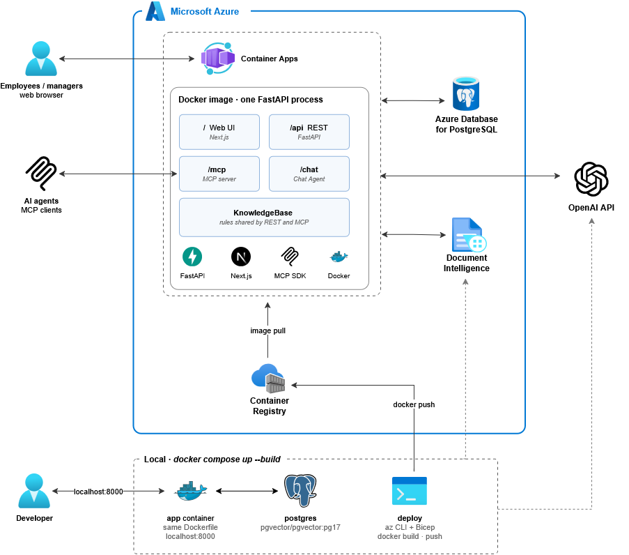
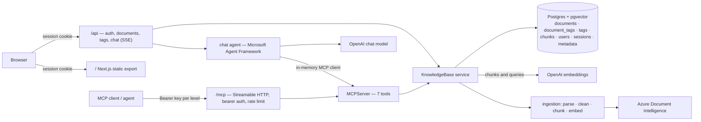

# doc-intelligence-server

A knowledge base for a financial-services company's internal documents that AI agents can query through an **MCP server**. It comes with an ingestion pipeline and a small web app to upload, tag, list and delete documents, and to chat with them.


## The scenario
For the context of this exercise, imagine an enterprise client, a financial services company, that has accumulated hundreds of internal documents across teams: compliance policies, product manuals, onboarding guides, FAQ exports, etc... Today, employees search for information using a shared drive with folders and filenames. It works, barely.

The client wants to connect this knowledge base to an AI assistant. Employees should be able to ask questions in natural language and get precise, grounded answers, with the agent knowing exactly which documents to search, when to filter by topic, and when to cast a wider net.

> **Today, finding an answer means knowing which folder and file to open.** <br> With this service, an employee asks a question in plain words, for example *"How long do we keep KYC records?"* and an AI assistant answers from the company's own documents, naming the document and page it extracted the information from. The assistant doesn't guess, it is grounded to the information present in the documents. It decides whether to search everything, one topic (such as *compliance*) or one named document. When nothing relevant exists, it says so **explicitly** rather than inventing an answer.


## Contents

- [1. Repository Structure](#1-repository-structure)
- [2. Architecture](#2-architecture)
  - [2.1 Where the rules live: KnowledgeBase](#21-where-the-rules-live-knowledgebase)
  - [2.2 Document management (requirement A)](#22-document-management-requirement-a)
    - [1. Upload documents](#1-upload-documents)
    - [2. Assign tags at upload](#2-assign-tags-at-upload)
    - [3. View the document list](#3-view-the-document-list)
    - [4. Delete a document](#4-delete-a-document)
  - [2.3 Ingestion pipeline (requirement B)](#23-ingestion-pipeline-requirement-b)
    - [1. Parse](#1-parse)
    - [2. Chunk: structure-aware recursive chunking](#2-chunk-structure-aware-recursive-chunking)
    - [3. Embed](#3-embed)
    - [4. Store chunks and embeddings: Postgres + pgvector](#4-store-chunks-and-embeddings-postgres--pgvector)
    - [5. Persist document metadata](#5-persist-document-metadata)
  - [2.4 Life of a question](#24-life-of-a-question)
- [3. Design choices](#3-design-choices)
- [4. MCP server design](#4-mcp-server-design)
- [5. Environment Variables](#5-environment-variables)
- [6. Run locally](#6-run-locally)
  - [6.1 Deploy to Azure](#61-deploy-to-azure)
- [7. Connect an MCP client](#7-connect-an-mcp-client)
- [8. Evaluation](#8-evaluation)
  - [8.1 Retrieval: chunk size and overlap](#81-retrieval-chunk-size-and-overlap)
  - [8.2 Retrieval: hybrid search and relevance floor](#82-retrieval-hybrid-search-and-relevance-floor)
  - [8.3 Tool selection](#83-tool-selection)
- [9. Known limitations and next steps](#9-known-limitations-and-next-steps)

## 1. Repository Structure

```
doc-intelligence-server
├── app/
│   ├── main.py           FastAPI app entry point
│   ├── config.py         Environment settings (Settings)
│   ├── agent.py          In-app chat agent
│   ├── auth/             Login and access levels (levels.py, sessions.py, session_guard.py)
│   ├── api/              REST routers (auth.py, documents.py, tags.py, chat.py)
│   ├── mcp_server/       MCP server (tools.py, auth.py, README.md)
│   └── rag/
│       ├── db.py         Schema and connection pool
│       ├── queries.py    All SQL queries
│       ├── kb/           Shared service layer (KnowledgeBase, models.py)
│       └── ingestion/    Document processing pipeline (parse.py, clean.py, chunk.py, embed.py)
├── frontend/             Next.js web UI (Login, Documents, Tags, Chat)
├── tests/                Unit tests (test_mcp_server.py, test_chunk.py)
├── eval/                 Evaluation scripts (retrieval.py, tool_selection.py, golden.jsonl, chunking_analysis.md)
├── Dockerfile            Single app image
├── docker-compose.yml    Local stack (Postgres, app)
├── infra/                Azure deployment (main.bicep, main.bicepparam)
├── .env.example          Environment template
└── requirements.txt      Runtime dependencies
```

## 2. Architecture

<p align="center">
  
</p>

### Flowchart



### 2.1 Where the rules live: [`KnowledgeBase`](app/rag/kb/service.py)

There is exactly one `KnowledgeBase`, created at startup in `main.py` and shared by every request. It holds the Postgres connection pool and the embedder. </br> 
REST (`app/api/`) and MCP (`app/mcp_server/tools.py`) are adapters that both call `KnowledgeBase`, so in-app chat uses the MCP tools themselves. Below it, `queries.py` only runs SQL, and `ingestion/` only transforms text.

```
REST routers (app/api/) ─────────┐                     ┌─► ingestion/
                                 ├─► KnowledgeBase ────┤
MCP tools (app/mcp_server/) ─────┘   rules and errors  └─► queries.py 
```

### 2.2 Document management (requirement A)

One page, **Documents**, covers four tasks:
1. Upload documents 
2. Assign one or more tags to each document at upload time
3. View the list of uploaded documents with their associated tags
4. Delete a document from the knowledge base
 
A second page, **Tags**: manages the tag vocabulary. 

The UI is a Next.js static export that calls the REST API with the login cookie and each route is a thin call into `KnowledgeBase`:

| Requirement | In the UI | REST call | `KnowledgeBase` |
|---|---|---|---|
| 1. | Drop zone or file picker, several files at once | `POST /api/documents`, one per file | `stage`, then `ingest` in the background |
| 2. | Tags multi-select; Upload stays disabled until one is picked | `tags` form field, repeated | `_check_tags` |
| 3. | Table with a chip per tag | `GET /api/documents` | `list_documents` |
| 4. | Delete button on each row, with a confirmation | `DELETE /api/documents/{id}` | `delete_document` |

#### 1. Upload documents

Files can be dropped on the page or picked, several at a time. **Upload** sends one `POST /api/documents` per file, so one bad file doesn't block the rest: failed files stay in the list with the server's error and the others appear in the table. A manager also picks the visibility (*Everyone* or *Managers only*).

**Formats.** PDF and plain text, and more: `.txt`, `.md`, `.csv` and `.json` are read locally; PDF, Word, Excel, PowerPoint, HTML and images go through Azure Document Intelligence. The picker doesn't filter by type.

**After the upload.** The request only checks the tags and hashes the bytes, then answers `200` for a Duplicate, `403` for a filename that belongs to a document the uploader can't read or `202` with a `processing` row. The pipeline in [2.3](#23-ingestion-pipeline-requirement-b) runs in the background. A Replacement stays listed as `ready`, with its old version searchable, until the new one is swapped in.

#### 2. Assign tags at upload

- **Pick one or more.** The Tags field is a multi-select filled from `GET /api/tags`. Upload stays disabled until at least one tag is selected and the server enforces the same rule: no tag, or an unknown one, gets `400` listing the valid tags.
- **A managed vocabulary, not free text**, so every document uses the names the agent filters on. `compliance`, `onboarding`, `product`, `hr` and `faq` are seeded at startup, each with a description the agent reads through `list_tags`. The Tags page adds tags, edits descriptions and deletes a tag only when no document carries it (`409` naming those documents).
- **Stored twice:** in `document_tags` for the list and the tag counts, and copied onto every chunk's `tags` array, so `search_by_tag` filters inside the same SQL query as the vector search.
- **Changing tags later:** upload the same file again with the new tags. Identical bytes are a Duplicate, so nothing is re-parsed, only the tags are replaced.

#### 3. View the document list

The table lists every document the user may read, newest first and in every status: name, tags (plus a *Managers only* chip), status (`processing`, `ready` or `failed`), pages, chunks, upload time and the ingest error, if any. `GET /api/documents` calls `list_documents(ready_only=False, limit=500)` (an employee never sees manager-only rows). While any row is `processing`, the page fetches the list again every 2 seconds, so each row turns `ready` or `failed` on its own.

#### 4. Delete a document

Each row has a **Delete** button, confirmed in a browser dialog. `DELETE /api/documents/{id}` calls `delete_document`, which runs one `DELETE FROM documents`. The chunks and tag links go with it through `ON DELETE CASCADE`, so the document leaves search results at once.

### 2.3 Ingestion pipeline (requirement B)

`KnowledgeBase.ingest` (`app/rag/kb/service.py`) runs the pipeline in a background task once the upload has answered `202`. Each requirement maps to one step:

| Requirement | Where | In short |
|---|---|---|
| 1. Parse the document and extract its text | `parse.py`, `clean.py` | Every format becomes `.md` with page spans: text formats locally, the rest through Azure Document Intelligence `prebuilt-layout`. Page headers, footers and numbers are removed. |
| 2. Chunk the text into meaningful segments | `chunk.py` | Structure-aware recursive chunking: heading, then paragraph, then sentence, about 500 tokens with 100 tokens of overlap inside a section, heading path on every chunk. |
| 3. Embed each chunk | `embed.py` | OpenAI `text-embedding-3-small` 100 chunks per call. |
| 4. Store chunks and embeddings in a vector store | `chunks` table, Postgres + pgvector | A `VECTOR` column with an HNSW cosine index, next to the text, pages, heading and tags. |
| 5. Persist document metadata | `documents` and `document_tags` tables, same Postgres | Filename, tags, upload date and chunk count, plus page count, status, content hash, access level and error. |


**Ingestion Process:** Each step is one module with a specific job. </br>
None of them imports another's logic; `KnowledgeBase.ingest` in `service.py` calls them in order and passes each output to the next step:

```
bytes ─► PARSE ─► ParsedDocument ─► CLEAN ─► ParsedDocument ─► CHUNK ─► list[Chunk] ─► embed ─► VECTORS
```

| Step | Takes | Returns | Its one job |
|---|---|---|---|
| `parse.py` | filename + bytes | `ParsedDocument`: Markdown + `PageSpan`s (where each page sits in the text) | Turn any format into one Markdown string. Text formats locally, everything else via Document Intelligence. |
| `clean.py` | `ParsedDocument` | `ParsedDocument` | Remove page headers, footers and numbers, page by page, **recomputing the spans** so they still point at the right text. |
| `chunk.py` | Markdown + spans | `list[Chunk]` | Cut the text into ~500-token passages with the heading path prepended, and use the spans to give each chunk its pages. |
| `embed.py` | the chunks' `text` | one vector per chunk, same order | Call the embedding API in batches of 100. The same embedder is used for the query at search time. |


#### 1. Parse

- **Text formats are read locally.** `.txt` and `.md` pass through as they are, `.csv` becomes one HTML `<table>` (the shape Document Intelligence gives tables), and `.json` is pretty-printed; invalid JSON fails the document. A local file counts as one page.
- **Everything else goes to Azure Document Intelligence** `prebuilt-layout` with Markdown output: PDF, Word, Excel, PowerPoint, HTML and images, with OCR for scans. It returns headings as `#`, tables as HTML `<table>`, and a span per page saying where that page sits in the text. The SDK call is synchronous, so it runs in a worker thread.
- **Cleaning.** Document Intelligence marks each page's header, footer, page number and page break with lines like `<!-- PageFooter="…" -->`. `clean.py` drops those lines page by page and recomputes the spans, so a repeated footer doesn't end up in every chunk and page numbers stay right.

#### 2. Chunk: structure-aware recursive chunking

The chunker follows the document's own structure and only cuts inside text when a piece is too big:

1. **Split the Markdown into blocks.** Tables are found first, so a blank line inside a table can't split it; the rest becomes headings and paragraphs, each with its character offsets.
2. **A heading starts a new chunk** and updates the heading path: a `##` replaces the previous `##` and drops anything deeper. The path, e.g. `Card Terms > Fees`, starts every chunk in that section and counts against its budget.
3. **Paragraphs are packed** into the current chunk until the next one would pass 500 tokens. A paragraph bigger than a chunk is split at sentence ends; a sentence bigger than a chunk is cut at a fixed token count, the only place a cut can land mid-word.
4. **Overlap stays inside a section.** When a section continues into a new chunk, that chunk starts with the last 100 tokens of the previous one, so an answer on the boundary is whole in at least one chunk. A heading or a table resets it.
5. **A table is its own chunk.** One that doesn't fit is split between rows, and each piece repeats the header row, so every piece is still a readable table.
6. **Pages come from offsets.** A chunk's first and last characters are looked up in the page spans, which gives `page_start` and `page_end`.


#### 3. Embed

- **Model: OpenAI `text-embedding-3-small`**, called with the provided OpenAI key.
- **What gets embedded** is each chunk's full text, heading path included, so a short paragraph still carries its topic. Chunks go 100 per API call, in a worker thread, with 3 retries.
- **The same embedder embeds the search query**, which is what makes query and chunk vectors comparable.

#### 4. Store chunks and embeddings: Postgres + pgvector

The vector store is the same Postgres that holds everything else, with the pgvector extension. One row per chunk in `chunks`:

| Column | Holds |
|---|---|
| `id` | `{document_id}:{first 8 hex chars of the content hash}:{chunk_index}` |
| `document_id` | the document it belongs to |
| `chunk_index`, `text`, `section`, `page_start`, `page_end` | position in the document, text (heading path included), heading path, pages |
| `embedding` | `VECTOR` |
| `tags` | a copy of the document's tags, so search filters by tag in the same query |
| `tsv` | a generated full-text vector of `text`, for the keyword half of hybrid search |


#### 5. Persist document metadata

Metadata lives in the same database, so it commits together with the chunks:

| Required | Stored as |
|---|---|
| Filename | `documents.filename`, `UNIQUE` |
| Tags | `document_tags` rows, each pointing at the `tags` vocabulary |
| Upload date | `documents.uploaded_at` |
| Chunk count | `documents.chunk_count` |

The row also holds `page_count`, `status` (`processing`, `ready` or `failed`), `content_hash`, `required_level` and `error`. This is what `GET /api/documents` and the MCP `list_documents` tool return.

### 2.4 Life of a question
1. An agent (or the in-app chat) sees the server `instructions` and seven tool definitions.
2. It picks a tool, for example `list_tags` then `search_by_tag(query, tags=["compliance"])`.
3. `KnowledgeBase` embeds the query and runs one SQL query: vector search and Postgres full-text search, fused with reciprocal rank fusion, inside the tag, document and access-level filters. Hits below the relevance floor are dropped unless they contain every query word.
4. Hits come back with the document name, heading, pages, score and chunk id. An empty result carries a `hint` on what to try next and an error names the fix (`Did you mean 'compliance'?`).
5. The model answers only from those passages; document and page are shown as sources. The in-app chat streams its tool calls, tokens and sources to the browser.

In the in-app chat, Microsoft Agent Framework runs steps 2 to 5 (`app/agent.py`). It calls the model, runs the tools the model picks one at a time and repeats until the model answers. It reaches the tools through an in-memory MCP client (`Client(mcp)`), not over HTTP, so no bearer key or rate limit applies; the viewer's level comes from their login session. After six tool calls it stops offering tools (`tool_choice: "none"`), so the next turn has to be the answer.

## 3. Design choices

| Area | Choice | Why |
|---|---|---|
| **Authentication** | **Login with two access levels** | A financial company has documents not everyone may read, so users are either *employee* or *manager* and manager-only documents are hidden from employees. **Security is out of scope for this exercise**, the login only exists to show that different users can see different documents. It is deliberately simple, with two demo accounts (`employee`/`demo` and `manager`/`demo`). |
| **Database** | **Postgres + pgvector** | A financial services company very likely already runs a relational database that has been in production for years, this exercise assumes Postgres to be it. Adding the pgvector extension to it, keeps the relation tables needed to create a document intelligence system, next to the vectors. That costs far less than running a separate vector database, and it avoids the work of integrating and keeping in sync a system that sits outside the company's existing stack.
| **Ingestion** | **Async ingestion** | Parsing and embedding a long file might take minutes, too long to hold an HTTP request open. **Async** used so you can interract with the app even when a file is being processed. The file upload is checked and status becomes `processing`. After processing, status will turn `ready` or `failed` (with the error shown). A document is never searchable half-processed. |
|  | **Dedup by content hash, identity by filename** | Re-uploading a document should not create duplicate. Two keys decide what an upload is. **Same bytes as a `ready` document** = Duplicate. Nothing is parsed or embedded again, only the tags (and a manager's access level) are updated. **Same filename, new bytes** = Replacement. It keeps the document id and re-ingests the new version (the old chunks stay searchable until the new ones are swapped in). **Anything else** = new document. |
| **Parsing strategy** | **Azure Document Intelligence** `prebuilt-layout` | A financial company's documents are exactly what this model is built for: policies organised by chapters, tabular documents, older scanned PDFs, etc... One API covers PDF, DOCX, XLSX, PPTX, HTML and images, with OCR for scans and returns Markdown that keeps the headings and tables.
|  | **Local parsing for `.txt`/`.md`/`.csv`/`.json`**| These formats are already a structured text. `.md` already has the headings DI would produce and `.csv` becomes the same HTML `<table>` DI outputs, so the chunker handles both paths the same way.
| **Embedding** | **`text-embedding-3-small`** | Chosen through measurement, after evaluation `-large` has nothing left to improve and would only cost 6.5× more per token and double the vector storage. |
| **Chunking** | **Chunking strategy**: Structure-aware recursive chunking | Most files are already organised by headings, so a heading is the natural boundary between topics, then paragraphs, then sentences. Tables stay whole or are split between rows. The heading path (*"3. Fees > 3.2 Late payment"*) is embedded with the text, so a short paragraph still carries its topic and it becomes the section the agent cites. |
|  | **Chunk size**: `MAX_TOKENS = 500` | The size was picked through testing, not guess. Common starting point is 400-512 tokens. The evaluation asks 328 questions over 100 sample files (chosen to look like a financial company's knowledge base) and repeats the test for chunk sizes from 150 to 1000 tokens. For each size it checks two things: how often the answer is in the top 5 hits and how much text the agent has to read for those 5 hits. |
|  | **Chunk overlap**: `OVERLAP_TOKENS = 100` (20% of a chunk) | Common starting point is 10-20% overlap. When a section is longer than one chunk, the last 100 tokens (three or four sentences) are repeated at the start of the next one, so an answer on the boundary appears whole in at least one chunk. The evalutation measured 0 to 30%. |
| **Search** | **Hybrid: vector + keyword search**, relevance floor `0.25` | Chosen through measurement. The agent searches with short keyword phrases, which vector search alone ranks worse. As expected adding keyword search improves answers. The floor only turns away requests unrelated to the documents: on a near miss, the model judges relevance itself. |
| **MCP transport** | **Streamable HTTP, stateless MCP** | **Streamable HTTP** is the MCP standard for remote servers: the agent sends each request to one web address (`/mcp`) and gets a complete unsplit reply back. **Stateless** the server keeps no session between requests. Every request brings what it needs, including the API key, so any copy of the server can answer it. It uses the official `mcp` Python SDK and runs inside the same FastAPI app as the UI and REST API (`app/main.py`). |
| **Chat agent** | [**Microsoft Agent Framework**](https://github.com/microsoft/agent-framework) | The in-app chat needs an agent: something that sends the question to the model, runs the tools the model asks for, gives it the results and repeats until the model writes an answer. Microsoft Agent Framework is an open-source library that does this loop. |
| **Frontend** | **Next.js static export** served by FastAPI | For the purpose of this exercise the frontend is designed only to be functional and usable. The UI is built with Next.js, then turned into plain HTML, CSS and JavaScript files at build time. The UI, REST API and MCP server all come from one app. |
| **Deployment** | **Azure Container Apps**+ **Azure Database for PostgreSQL**; `docker compose` for local | The app ships as one Docker image and Container Apps runs the container. Postgres runs as a managed Azure database. |


## 4. MCP server design

The MCP server is documented in **[app/mcp_server/README.md](app/mcp_server/README.md)**: the live endpoint and how to authenticate, the seven tools with their input schemas, descriptions and results, the tool-selection eval, the stateless Streamable HTTP transport and the authentication design.

## 5. Environment Variables

Copy `.env.example` to `.env` and fill in the empty values. All settings come from the environment (`app/config.py`).

| Variable | Default | Purpose |
|---|---|---|
| `DATABASE_URL` | **required** | Postgres connection string. Docker Compose sets it for you |
| `OPENAI_API_KEY` | **required** | Key for embeddings and chat |
| `EMBEDDING_MODEL` | `text-embedding-3-small` | Embedding model. Fixed once the database has data |
| `CHAT_MODEL` | `gpt-5.4-mini` | Model for the in-app chat |
| `AZURE_DI_ENDPOINT`, `AZURE_DI_KEY` | **required** | Azure Document Intelligence credentials |
| `MCP_API_KEY_EMPLOYEE`, `MCP_API_KEY_MANAGER` | **required** | The two `/mcp` keys, one per access level. Several comma-separated keys per level allow rotation |
| `MCP_RATE_LIMIT_PER_MINUTE` | `300` | Requests per minute per MCP key before `429` |
| `PUBLIC_HOST` | `localhost:8000` | Public hostname of the app. Must match in Azure, or `/mcp` answers `421` |
| `RELEVANCE_FLOOR` | `0.25` | Minimum similarity score for a search hit; a hit containing every query word is kept anyway |
| `HYBRID_SEARCH` | `true` | Fuses keyword search into vector search |

To test, generate the MCP keys with `python -c "import secrets; print(secrets.token_urlsafe(32))"`.

## 6. Run locally

**Prerequisites:** Docker with Compose, an OpenAI API key and an Azure Document Intelligence resource (endpoint and key).

**1. Configure.** Copy the template and fill in the values:

```bash
cp .env.example .env
```

- `OPENAI_API_KEY`: your OpenAI key.
- `AZURE_DI_ENDPOINT`, `AZURE_DI_KEY`: your Document Intelligence endpoint and key.
- `MCP_API_KEY_EMPLOYEE`, `MCP_API_KEY_MANAGER`: two random keys.

**2. Start.** Postgres and the app, in one command:

```bash
docker compose up --build
```

- App: <http://localhost:8000>. Log in as **`employee`/`demo`** or **`manager`/`demo`**.
- MCP endpoint: `http://localhost:8000/mcp`. Health check: `http://localhost:8000/healthz`.

### 6.1 Deploy to Azure

[`infra/main.bicep`](infra/main.bicep) defines:
- Postgres Flexible Server 17 (B1ms, with pgvector allowlisted).
- A Container Registry.
- A Container Apps environment with one app, running as a single replica.

[`infra/main.bicepparam`](infra/main.bicepparam) reads every value from the environment. Add `PG_ADMIN_PASSWORD` (hex only) to `.env`, then run from Git Bash:

```bash
set -a && . <(tr -d '\r' < .env) && set +a

# 1. Infra only. Outputs acrLoginServer, pgHost and url.
az deployment group create -g <resource-group-name> -p infra/main.bicepparam

# 2. Build and push the image
ACR=<acrLoginServer>
az acr login -n ${ACR%%.*}
docker build -t $ACR/indigo-kb:v1 . && docker push $ACR/indigo-kb:v1

# 3. App. Every later deploy repeats this with a new tag.
APP_IMAGE=$ACR/indigo-kb:v1 az deployment group create -g <resource-group-name> -p infra/main.bicepparam
```


## 7. Connect an MCP client

- **Endpoint:** `http://localhost:8000/mcp` locally, `https://<azure-containterapp-link>.azurecontainerapps.io/mcp` in Azure. Transport: Streamable HTTP.
- **Authentication:** send `Authorization: Bearer <key>` on every request. Use **`MCP_API_KEY_EMPLOYEE`** for employee-level results or **`MCP_API_KEY_MANAGER`** for everything. 

| Client | How it sends the key | Works with these keys |
|---|---|---|
| Claude Code | `--header` | yes |
| Claude Desktop | through `mcp-remote --header` (below) | yes |
| MCP Inspector, Postman, VS Code, Cursor | a header field in the connection settings | yes |
| Claude Messages API (MCP connector) | `authorization_token` | yes, from the public Azure URL |
| Azure AI Foundry Agent Service | a custom header on the MCP tool | yes |


**curl** (a bare JSON-RPC call; stateless mode answers it without a handshake):
```bash
curl -s http://localhost:8000/mcp -H "Authorization: Bearer $MCP_API_KEY_EMPLOYEE" \
  -H 'Accept: application/json, text/event-stream' -H 'Content-Type: application/json' \
  -d '{"jsonrpc":"2.0","id":1,"method":"tools/call","params":{"name":"search","arguments":{"query":"daily ATM withdrawal limit","top_k":3}}}'
```

**MCP Inspector:** run `npx @modelcontextprotocol/inspector`, choose transport *Streamable HTTP*, enter the URL, and add the `Authorization: Bearer …` header under Authentication.

**Claude Code**
```bash
claude mcp add --transport http indigo-kb http://localhost:8000/mcp --header "Authorization: Bearer $MCP_API_KEY_EMPLOYEE"
```

**Claude Desktop**'s connectors need an HTTPS URL reachable from outside your machine, so they can't reach `localhost`, and header auth there is a limited beta. A local `mcp-remote` bridge adds the header instead. In `claude_desktop_config.json`:
```json
{
  "mcpServers": {
    "indigo-kb": {
      "command": "npx",
      "args": ["mcp-remote", "http://localhost:8000/mcp", "--header", "Authorization:${KB_AUTH}"],
      "env": { "KB_AUTH": "Bearer <MCP_API_KEY_EMPLOYEE>" }
    }
  }
}
```
The space after `Bearer` lives in the env value because Claude Desktop on Windows doesn't escape spaces in `args`. For Azure, swap in the `https://` URL.

**VS Code** (`.vscode/mcp.json`; it asks for the key once and stores it as a secret):
```json
{
  "inputs": [{ "id": "kb-key", "type": "promptString", "description": "Indigo KB MCP key", "password": true }],
  "servers": {
    "indigo-kb": {
      "type": "http",
      "url": "http://localhost:8000/mcp",
      "headers": { "Authorization": "Bearer ${input:kb-key}" }
    }
  }
}
```

**Python** (`mcp` SDK v2, the same package as the server):
```python
import asyncio, os

import httpx2
from mcp.client import Client
from mcp.client.streamable_http import streamable_http_client

AUTH = {"Authorization": f"Bearer {os.environ['MCP_API_KEY_EMPLOYEE']}"}


async def main() -> None:
    transport = streamable_http_client("http://localhost:8000/mcp", http_client=httpx2.AsyncClient(headers=AUTH))
    async with Client(transport) as kb:
        print([tool.name for tool in (await kb.list_tools()).tools])
        found = await kb.call_tool("search", {"query": "daily ATM withdrawal limit", "top_k": 3})
        for hit in found.structured_content["results"]:
            print(hit["rank"], hit["document_name"], hit["page_start"], hit["text"][:80])


asyncio.run(main())
```

**Claude Messages API, Postman, Azure AI Foundry:** each takes the URL and the key. The Messages API's MCP connector takes it as `authorization_token` and must reach the server over the internet, so use the Azure URL. Postman and Foundry take it as an `Authorization` header.

## 8. Evaluation

Two scripts in `eval/` measure the two things that decide answer quality: 
1. **Retrieval** - Whether search finds the right passage
2. **Tool Selection** - Whether a model picks the right tool with the right arguments

### 8.1 Retrieval: chunk size and overlap

**What it measures.** `python -m eval.retrieval` runs the real pipeline (parser, chunker, embedder, database, search) on every file in `files/`, once per chunk size and overlap, and asks the questions in `eval/golden.jsonl`. A question counts as answered when one of the hits contains its **evidence**: the sentence or passage of the document that answers it, copied word for word. Because the target is the text itself, every chunking is judged against the same answer.

**The questions.** 383 questions over 100 files:
- 248 short facts (a fee, a deadline, a code) and 80 longer answers of 25 to 96 words (a procedure, a list of conditions), which a chunk boundary can cut in two;
- 13 questions on the 26,873-row Bitext customer-support CSV, and 3 exact-code lookups (`COMP-POL-001`, `HR-188`);
- 55 **negatives** the documents cannot answer: 13 near misses (the Chase agreement explains currency conversion but gives no exchange rate) and 42 off-topic requests (weather, recipes, sport, code), 40 of them added to set the relevance floor ([§8.2](#82-retrieval-hybrid-search-and-relevance-floor)).

The fact and passage questions were drafted by `gpt-5.4-mini` from random passages of each document and then reviewed by hand. Each question also carries the `query` the in-app agent would search it with.

**Results** (`text-embedding-3-small`, vector search only, on the questions as written; `HYBRID_SEARCH=false` reproduces them). ans@k = the answer is in the top k hits; tokens@5 = how much text the agent reads for 5 hits; intact = share of answers left whole in at least one chunk. One row per size at 20% overlap, then other overlaps at 500:

| chunk tokens | overlap | chunks | intact | ans@1 | ans@5 | MRR | ans@5, facts (248) | ans@5, passages (80) | ans@5, long docs (77) | tokens@5 |
|---|---|---|---|---|---|---|---|---|---|---|
| 150 | 30 | 31,218 | 0.909 | 0.500 | 0.790 | 0.622 | 0.887 | 0.487 | 0.740 | 673 |
| 200 | 40 | 29,904 | 0.948 | 0.537 | 0.820 | 0.660 | 0.875 | 0.650 | 0.753 | 821 |
| 300 | 60 | 25,664 | 0.976 | 0.573 | 0.878 | 0.699 | 0.911 | 0.775 | 0.779 | 1,076 |
| 400 | 80 | 18,792 | 0.994 | 0.579 | 0.875 | 0.708 | 0.895 | 0.812 | 0.792 | 1,288 |
| **500** | **100** | **15,152** | **0.991** | **0.555** | **0.905** | **0.703** | **0.923** | **0.850** | **0.844** | **1,450** |
| 700 | 140 | 10,171 | 0.997 | 0.601 | 0.905 | 0.729 | 0.915 | 0.875 | 0.844 | 1,694 |
| 1000 | 200 | 7,006 | 1.000 | 0.601 | 0.905 | 0.731 | 0.915 | 0.875 | 0.870 | 1,917 |
| 500 | 0 | 15,126 | 0.985 | 0.567 | 0.902 | 0.705 | 0.927 | 0.825 | 0.831 | 1,425 |
| 500 | 50 | 15,136 | 0.988 | 0.552 | 0.899 | 0.696 | 0.919 | 0.838 | 0.831 | 1,435 |
| 500 | 150 | 15,172 | 0.991 | 0.558 | 0.893 | 0.702 | 0.911 | 0.838 | 0.831 | 1,475 |

**What was chosen, and why:**
- **500-token chunks.** Below 300, clearly fewer answers are found. From 300 up, short facts are found equally well and the difference is in longer answers Overall, answers found stop rising at 500, while the text the agent reads keeps growing: 700 and 1000 find nothing more but read 17% and 32% more text. 400 is statistically tied with 500; 500 was chosen because it finds more answers in every group for about 160 more tokens per search.
- **20% overlap.** From 300 tokens up, overlap changes the answers found by at most 1.5 points, which is noise: the chunker already cuts at headings, paragraphs and sentences, so at 500, 98.5% of answers stay whole even without overlap. 20% keeps two more answers whole for 2% more text.

**To consider.** Questions drafted from a passage share more words with it than real users' questions do. 80 longer-answer questions can detect a 10-point difference, not a 3-point one.

**Tuning.** Chunk size and overlap are constants in `app/rag/ingestion/chunk.py`, `MAX_TOKENS = 500` and `OVERLAP_TOKENS = 100`, not environment variables. A change only affects new uploads: originals aren't stored, so existing documents must be re-uploaded.

### 8.2 Retrieval: hybrid search and relevance floor

**Results** at 500 tokens with 20% overlap (328 questions with evidence, 13 near misses, 42 off-topic). Each question was searched in two ways:
- **The question as written:** the full sentence
- **The question as the agent would query it:** simulating the behaviour of the agent. The way how the app really searches.

| searched with | ans@1 | ans@5 | MRR | tokens@5 | ans@5 gained / lost | significant? |
|---|---|---|---|---|---|---|
| written query | 0.555 → 0.622 | 0.905 → 0.915 | 0.703 → 0.712 | 1,442 → 1,780 | +16 / −13 | no (p = 0.71) |
| **agent query** | **0.451 → 0.604** | **0.802 → 0.881** | **0.606 → 0.730** | **1,373 → 1,654** | **+35 / −9** | **yes (p < 0.001)** |

With the agent's queries, hybrid finds more answers on every kind of document.

**Relevance floor** (hybrid, the agent's queries):

| floor | answers lost | near misses past it (of 13) | off-topic past it (of 42) |
|---|---|---|---|
| 0.20 | 0 | 13 | 26 |
| **0.25** | **0** | **13** | **9** |
| 0.30 | 1 | 13 | 5 |
| 0.37 | 4 | 11 | 1 |
| 0.45 | 7 | 7 | 1 |

**What was chosen, and why:**
- **`HYBRID_SEARCH=true`** the agent searches with short keyword phrases, and vector search handles them poorly: ans@5 drops from 0.905 with written queries to 0.802 with agent queries. Adding keyword search wins most of that back: hybrid puts 35 answers in the top 5 that vector search missed and loses 9, and the answer comes first 60% of the time instead of 45%.
- **`RELEVANCE_FLOOR=0.25`**, the minimum score a hit needs to be returned. Bbelow 0.25 off-topic requests get through: 26 of 42 at 0.20, against 9 at 0.25.
- **Shortlist of 3 × `top_k` candidates per side**. Hybrid takes a shortlist from vector search and one from keyword search, then merges them. Longer shortlists lose answers with written queries, because chunks that share only common words with the query start scoring on both sides.

### 8.3 Tool selection

`python -m eval.tool_selection` runs 12 prompts through the in-app agent against the real MCP server. Only the database is replaced by an in-memory copy of the document list, so it calls only the chat model. It checks the first tool chosen, the arguments (the tag, the exact document name), recovery after an error, fetching more context when a hit is cut off and using no tool for an off-topic question. `--no-instructions` leaves out the server instructions, as some clients do; `--repeat 5` checks stability.

## 9. Known limitations and next steps

**Limitations**
- **Authentication is a simplified demo, not a security design.** Security in general was out of scope for this exercise. The only goal was to show that users with different access levels see different documents. In practice:
  - **Two seeded accounts, both with the password `demo`.** Passwords are only salted and hashed. There is no rate limiting on login attempts, no password rules, no reset flow and no signup.
  - **Exactly two levels, employee and manager, and nothing finer.** Every manager sees every manager-only document and every employee sees every employee document. A manager can't keep a document from other managers, and there are no teams, departments or other smaller groups with their own documents. Real access control would need per-user or per-group permissions on each document.
  - **Access is by role, not by person.** Anyone holding the manager MCP key is "a manager". Every list is filtered by level, the Documents table and tag counts included: an employee never sees that a manager-only document exists. The one exception is an upload under the same filename, which is refused: filenames are unique, so it reveals that the name is taken, never the content.
- **Files are not stored.** Changing the chunk size or embedding model means re-uploading the files to apply changes.
- **No reranker; basic keyword search.** The keyword half of hybrid search uses the `simple` config (no stemming) and `ts_rank`, which has no IDF weighting, so a common word counts as much as a rare one.
- **Ingestion runs in-process** (`BackgroundTasks`). A restart mid-ingest marks the document `failed` (never half-written) and a re-upload retries it. For that reason the deploy keeps one replica.